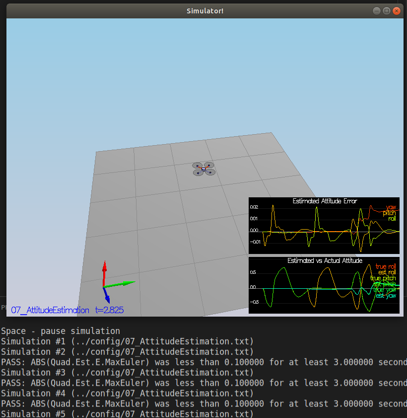
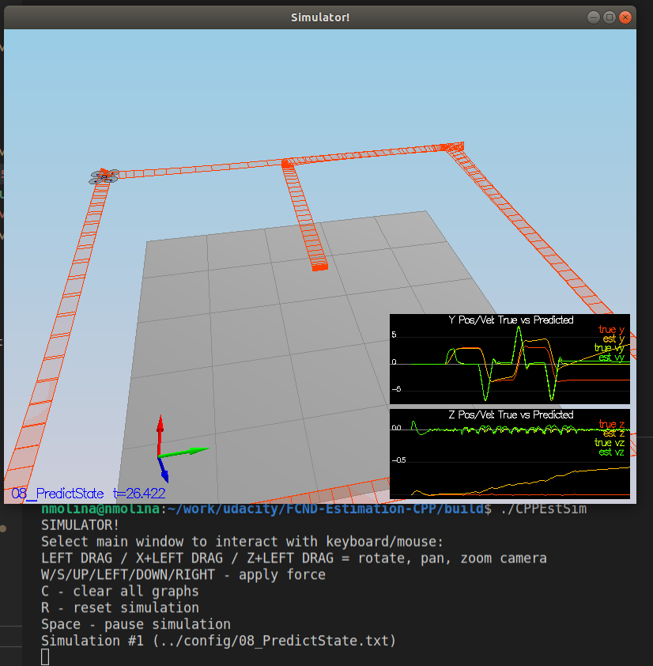
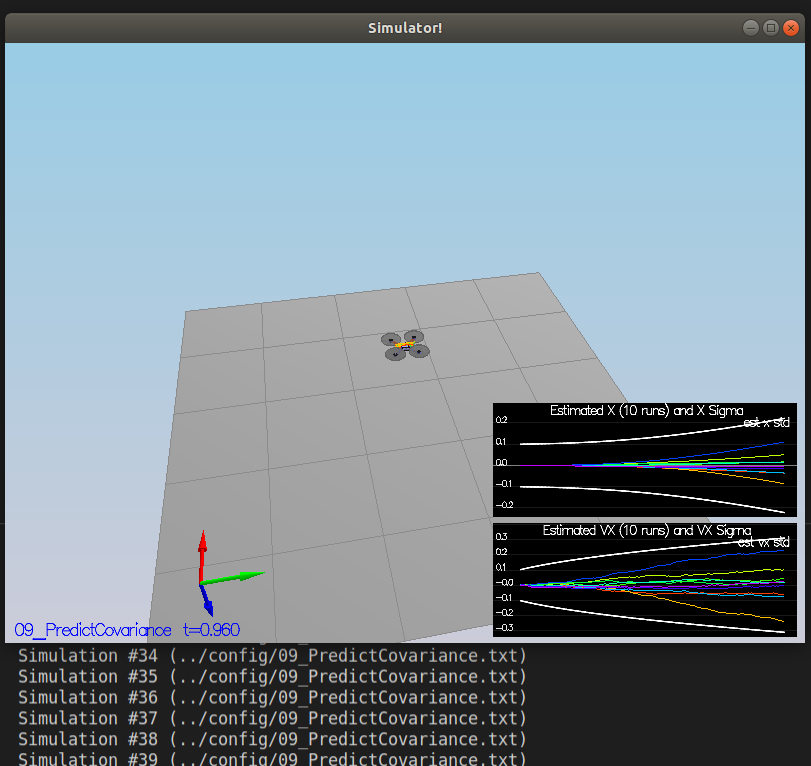
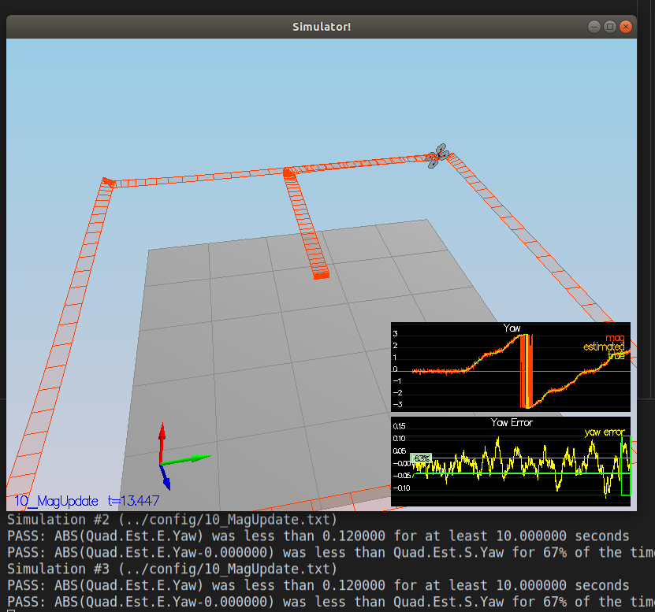
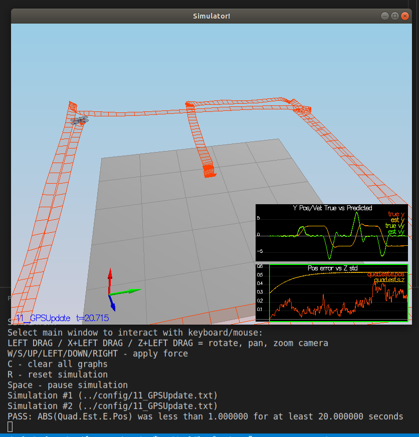

# Estimation Project #

The following explains how the project Estimation Project was implemented.

The project is structured to progress incrementaly by passing the test of different scenarios. Simillarly to the 3D controller

### Sensor Noise (scenario 6) ###

To set `MeasuredStdDev_GPSPosXY` and `MeasuredStdDev_AccelXY` I used the data obtained in `config/log/Graph2*.txt`, calculating std deviation in libreOffice calc.

### Attitude Estimation (scenario 7) ###

We use the Non linear complementary filter. First we obtain the quaternion state `qt` and the meassurements from IMU `dq`. The predicted state is then `qt_bar` the dot product `qt` and `dq`.

Now predicted roll, pitch and yaw, are obtained from the predicted quaternion `qt_bar`.

### Prediction Step (scenario 8 and 9) ###

In `PredictState()` we only predict the state without considering the control input.

In `GetRbgPrime()` we calculate Rgb as defined [Estimation for Quadrotors](https://www.overleaf.com/read/vymfngphcccj)

Later we implement the complete predicton in `Predict()`. We fill gPrime using `GetRbgPrime()` and calculate `ekfCov` as defined in [Estimation for Quadrotors](https://www.overleaf.com/read/vymfngphcccj)

Finally we tune `QPosXYStd` and the `QVelXYStd` in order to get a good covariance prediction

### Magnetometer Update (scenario 10) ###

Here we have to implement `UpdateFromMag()` we simply initialize `zFromX` with `ekfstate(6)` that was previusly updated in `UpdateFromIMU()`.

### Closed Loop + GPS Update (scenario 11) ###

We fill `UpdateFromGPS()` we simply provide the ekfState and define hPrime.

We use our `QuadControl` implementation from the previous project. Detuning was not necessary. The previous parameters work fine also with the estimated state variables.

